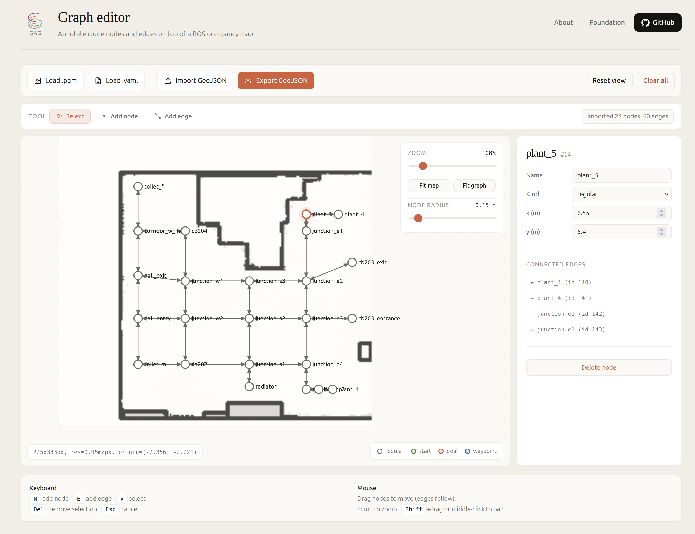

<div align="center">


# nav2-graph-editor

**A browser-based editor for annotating route graphs on top of ROS occupancy grid maps.**

[Live demo](https://andrei-staicu.github.io/nav2-graph-editor/) · [Quick start](#quick-start) · [Foundation](#foundation)

</div>

---

<p align="center">
  
</p>

## What is this?

Most ROS navigation pipelines plan paths using a costmap alone. That works for free-space wandering, but breaks down for any task that needs **structured routes**: navigating between named places, respecting one-way corridors, applying per-edge speed limits, or feeding waypoints into a semantic planner.

For these cases you need a **route graph**: nodes that mark places, edges that mark allowed transitions, and metadata that the planner can consume. Nav2 route servers and similar systems read these as GeoJSON files in the map frame.

Building this by hand is painful. You drive the robot to each point, read the `(x, y)` from `/amcl_pose`, write the GeoJSON manually, then repeat the loop because one node was off. **This tool removes the loop entirely.** Load your map, click to drop nodes, click to draw edges, edit properties in a side panel, export GeoJSON.

Everything runs in your browser. No backend, no install, no dependencies.

---

## Quick start

### Option 1, use the hosted version

Open **[the live demo](https://andrei-staicu.github.io/nav2-graph-editor/)** in any modern browser. Nothing to install.

### Option 2, run locally

```bash
git clone https://github.com/andrei-staicu/nav2-graph-editor.git
cd nav2-graph-editor
xdg-open index.html        # Linux
# or
open index.html            # macOS
# or just double-click index.html on Windows
```

The whole app is a single HTML file with no build step.

---

## Walkthrough

### 1. Load your map

Click **Load .pgm** to open the occupancy grid image (the binary or ASCII PGM file produced by `slam_toolbox`, `gmapping`, or `cartographer`).

Click **Load .yaml** to open the matching map metadata file. The editor reads `resolution` (metres per pixel) and `origin` (the world-frame coordinates of the image's bottom-left corner) so that all graph coordinates are in **map-frame metres**, exactly as Nav2 expects.

After loading, click **Fit map** in the zoom panel to centre the view on the map.

> The info overlay at the bottom-left of the canvas confirms what was read, e.g. `225x333px, res=0.05m/px, origin=(-2.356, -2.221)`.

### 2. Place nodes

Press `N` or click **Add node** in the toolbar to enter node-placement mode. Click anywhere on the map to drop a node at that location, with coordinates automatically calculated in map-frame metres.

Select a node with `V` (Select mode) and click it. The side panel now shows:

- **Name**, edit it to whatever makes sense for your domain (`hall_entry`, `plant_5`, `cb204`, etc.)
- **Kind**, choose between `regular`, `start`, `goal`, or `waypoint`. Colours change accordingly.
- **x, y**, edit the coordinates manually for precise positioning
- **Rotation**, the orientation (yaw) the robot should hold at this node, see below
- **Connected edges**, lists all edges touching this node, click to jump to one

Drag any node with the mouse to reposition it. Connected edges follow in real time, and the panel coordinates update as you drag.

#### Node orientation (yaw)

A selected node shows an arrow starting from its centre. Drag the round handle at the tip to point it wherever the robot should face when it arrives. The **Rotation** section of the panel mirrors it with a dial you can drag and a **Degrees** field you can type into, and **Clear rotation** removes the value again.

Yaw is stored in radians in the map frame, counter-clockwise positive, `0` pointing along `+x`, the same convention as `geometry_msgs/Pose` after conversion from a quaternion. Nodes that have a yaw keep a dim arrow when they are not selected, so a whole graph of oriented docking or inspection poses is readable at a glance. Nodes without one export no `yaw` property at all.

### 3. Draw edges

Press `E` or click **Add edge**. Click the first node, then the second node. By default this creates a **bidirectional pair** of edges with their `penalty` field set to the Euclidean distance between the nodes.

Select any edge by clicking its line. The side panel exposes:

- **Direction**, switch between `Bidirectional` and `Unidirectional`. Switching from bidirectional removes the reverse edge.
- **Reverse direction** button (only for unidirectional), flips `startid` and `endid` so the arrow points the other way.
- **Cost** and **Override**, the standard Nav2 route fields
- **Metadata**, an editable dictionary. Add any key-value pair your planner needs (`penalty`, `speed_limit`, `surface_type`, `requires_door_open`, anything).
- **Recompute penalty from distance**, useful after dragging nodes; it updates both directions.

### 4. Import existing graphs

If you already have a `route_graph.geojson` file, click **Import GeoJSON** to load it. The editor reconstructs all nodes, edges, and metadata, and uses the map's origin so everything appears at the correct world-frame coordinates.

### 5. Move around the map

The control at the top-left of the canvas has **+** and **&minus;** buttons for zooming around the centre of the view, a horizontal slider for panning left and right, and a live zoom percentage. Mouse scroll still zooms around the cursor, and Shift+drag or middle-click drag still pans freely in both axes.

### 6. Fit a graph onto a new map (move / rotate a group)

A graph drawn on one map rarely lines up with a new map of the same place (a new SLAM run, a different robot). Instead of moving every node by hand, press **T** or click **Transform**:

- **Select** with `Ctrl/⌘+A` (all nodes), a drag on empty space (box select, `Alt` adds to it), or `Ctrl/⌘`+click on single nodes.
- **Move** the group by dragging inside the dashed box, or with the arrow keys (5 cm, `Shift` for 50 cm).
- **Rotate** it by dragging the **↻** handle above the pivot (`Shift` snaps to 5°), or with `[` and `]` (0.5°, `Shift` for 5°). The pivot is the centre of the selection; **Pivot: click on map** fixes it anywhere, for example on a door frame you can recognise on both maps.
- **Exact values**: type dx, dy and an angle, then **Apply**. The panel keeps the running total of what was applied, and **Undo all** returns to where you started.

Edges follow their nodes, and every node orientation (`yaw`) rotates with the group, so the graph stays consistent. Transform mode never deletes nodes, even if `Del` is pressed.

### 7. Export

Click **Export GeoJSON**. A file named `graph.geojson` downloads, formatted in the stable layout described below. Drop it into your Nav2 route server config and you're done.

---

## Output format

The exported GeoJSON uses EPSG:3857 with coordinates in map-frame metres. Each feature sits on one line, with bidirectional pairs and node groups separated by blank lines for clean diffs:

```json
{
  "crs": { "type": "name", "properties": { "name": "urn:ogc:def:crs:EPSG::3857" } },
  "type": "FeatureCollection",
  "name": "graph",
  "features": [
    { "type": "Feature", "geometry": { "type": "Point", "coordinates": [ 1.0, 0.0 ] }, "properties": { "frame": "map", "id": 0, "name": "start", "yaw": 1.571 } },

    { "type": "Feature", "geometry": { "type": "MultiLineString", "coordinates": [ [ [ 1.0, 0.0 ], [ 2.4, 1.0 ] ] ] }, "properties": { "id": 10, "startid": 0, "endid": 3, "cost": 0, "overridable": true, "metadata": { "penalty": 28.32, "speed_limit": 60.0 } } },
    { "type": "Feature", "geometry": { "type": "MultiLineString", "coordinates": [ [ [ 2.4, 1.0 ], [ 1.0, 0.0 ] ] ] }, "properties": { "id": 11, "startid": 3, "endid": 0, "cost": 0, "overridable": true, "metadata": { "penalty": 28.32, "speed_limit": 60.0 } } }
  ]
}
```

`yaw` is optional and appears only on nodes that have an orientation set. It is rounded to three decimals (about 0.06 degrees) and survives an import/export round trip.

This format is stable across exports, so re-saving an unchanged graph produces a byte-identical file. Version control behaves cleanly.

---

## Features at a glance

| Capability | Notes |
|---|---|
| Native PGM parsing | Both binary (P5) and ASCII (P2), no external libraries |
| Native YAML parsing | Both inline (`origin: [a, b, c]`) and block (`origin:` followed by `- a`, `- b`, `- c`) |
| Bidirectional / unidirectional edges | Toggle per-edge with one click |
| Reverse direction | One-click flip of edge direction |
| Arbitrary edge metadata | Any key-value pair, parsed as number when possible |
| Node types | `regular`, `start`, `goal`, `waypoint`, colour-coded |
| Node orientation | Per-node yaw, drag the arrow on the node or the dial in the panel, exported as `yaw` |
| Drag-to-move | Nodes drag smoothly, edges follow |
| Group move / rotate | Select all or part of the graph, drag, rotate around a pivot or type exact values; orientations rotate too |
| Zoom / pan | Mouse scroll, on-canvas +/- buttons and pan slider, overlay slider, Shift+drag, middle-click drag |
| Fit to map / graph | Auto-frame either the map or the graph extent |
| Round-trip GeoJSON | Import existing graphs, edit, export in the same stable format |
| Self-contained | Single HTML file, no build, no install, works offline |

---

## Keyboard shortcuts

| Key | Action |
|---|---|
| `N` | Add node mode |
| `E` | Add edge mode |
| `V` | Select mode |
| `T` | Transform mode (move / rotate a group) |
| `Ctrl/⌘+A` | Select all nodes (transform mode) |
| Arrows | Move the group 5 cm, `Shift` 50 cm (transform mode) |
| `[` / `]` | Rotate the group 0.5°, `Shift` 5° (transform mode) |
| `Del` | Delete selected node or edge |
| `Esc` | Cancel current action |

---

## Foundation

This tool was built in support of the **Semantic Autonomy Stack (SAS)**, a layered architecture for mobile robot autonomy that combines geometric navigation with semantic memory and language-grounded reasoning. The graph editor exists to lower the friction of building the route layer that SAS sits on top of.

Related publications:

- **MDPI Sensors**, [doi:10.3390/s26072232](https://www.mdpi.com/1424-8220/26/7/2232), Angular Sector Fusion and semantic route planning for autonomous mobile robots
- **arXiv:2605.02525**, [link](https://arxiv.org/abs/2605.02525), Cross-robot semantic memory transfer experiments in the SAS framework

## Credits

| | |
|---|---|
| **Author** | STAICU Andrei-Alexandru |
| **Thesis coordinator** | Conf. dr. ing. ABAZA Bogdan-Felician |
| **Affiliation** | National University of Science and Technology Politehnica Bucharest, FIIR |

## License

MIT, see [LICENSE](LICENSE).

## Contributing

Issues and pull requests welcome. The whole app is in `index.html` (HTML, CSS, JS in one file). For now, please keep the zero-dependency, no-build philosophy.
